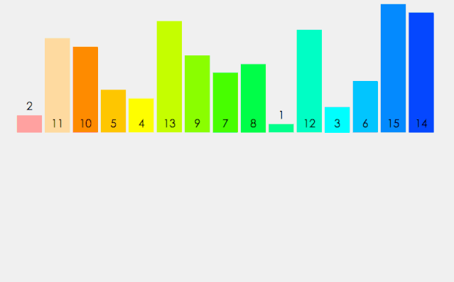

### 归并排序

假设初始序列含有n个记录，则可以看成n个有序的子序列，每个子序列的长度为1，然后两两归并，得到（>=n/2）个长度为2或1 的有序子序列，再两两归并，直到得到一个长度为n的有序序列为止，这就叫2路归并。

```javascript
const mergesort = arr=>{
	const len = arr.length
	if(len < 2){
		return arr
	}
	let mid = Math.floor(len/2)  //js里面 3/2=1.5
	let left = arr.slice(0,mid) //slice左闭右开
	let right = arr.slice(mid)
	return merge(mergesort(left),mergesort(right))
}
let merge = (left,right)=>{
	const res = []
	while(left.length && right.length){
		if(left[0]<=right[0]){
			res.push(left.shift())  //shift操作改变原数组
		}else{
			res.push(right.shift())
		}
	}
	while(left.length) res.push(left.shift());
	while(right.length) res.push(right.shift());
	return res
}
let arr = [2,3,4,1,5,6,8,7,9]
//console.time,console.timeEnd这两个方法可以用来测量JavaScript脚本程序执行消耗的时间。
//都可以传入一个参数，作为计时器的名称，用来区分各个计时器
//注意一点：这两个参数名称要一致
console.time('归并排序消耗时间') //启动计时器
console.log(mergesort(arr))
console.timeEnd('归并排序消耗时间') //停止计时，输出时间
(9) [1, 2, 3, 4, 5, 6, 7, 8, 9]
归并排序消耗时间: 0.40380859375 ms
```


### 分析

1.归并排序不是原地排序，需要借助额外的空间

2.是一种稳定排序

3.每层O(n)，深度为 logn ，故时间复杂度为O(nlogn)。

最佳情况，最差情况，平均情况 都是O(nlogn)。


